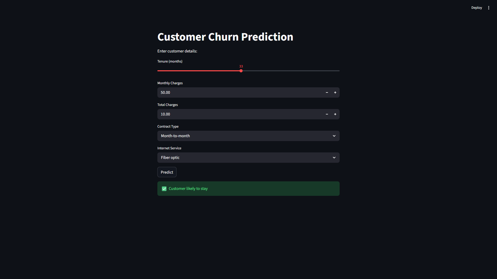

# Customer Churn Prediction System

## 📌 Objective

To build a machine learning model that predicts whether a customer is likely to churn, and deploy it as an interactive web application.

---

## 🛠️ Tech Stack

* Python
* Pandas, NumPy
* Scikit-learn
* Matplotlib
* Streamlit
* Joblib

---

## 📊 Dataset

Telco Customer Churn dataset (Kaggle)

---

## ⚙️ Project Workflow

1. Data Cleaning

   * Converted `TotalCharges` to numeric
   * Handled missing values
   * Removed unnecessary columns

2. Feature Engineering

   * Encoded categorical variables using one-hot encoding
   * Prepared dataset for model training

3. Model Building

   * Trained Logistic Regression model
   * Split dataset into training and testing sets

4. Evaluation

   * Evaluated using Accuracy, Precision, Recall, F1-score

5. Deployment

   * Saved model using Joblib
   * Built Streamlit app for real-time predictions

---

## 🚀 Features

* Predict customer churn based on input data
* Interactive UI using Streamlit
* Real-time predictions

---

## ▶️ How to Run

### 1. Clone repository

```
git clone https://github.com/SandeshRoy/churn-project.git
cd churn-project
```

### 2. Install dependencies

```
pip install -r requirements.txt
```

### 3. Run app

```
python -m streamlit run app.py
```

---

## 📈 Model Performance
- Accuracy: 0.84
- Precision: 0.78
- Recall: 0.70
- F1-score: 0.74

---
## 🖥️ App Preview



## 🔗 Author

Sandesh E J
